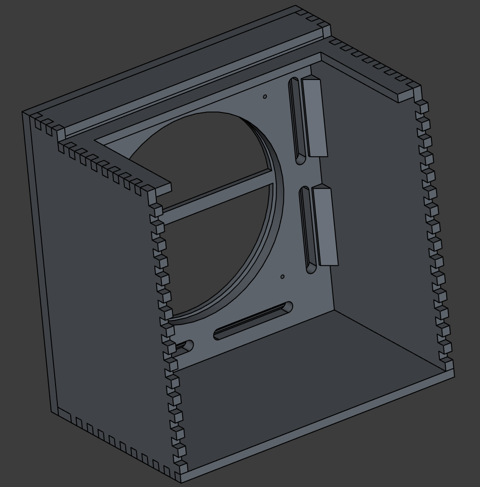

# Ampeg B15N Double Baffle cabinet

This a 3D model of the [Ampeg B15N Double Baffle](https://www.talkbass.com/wiki/technical-speaker-cabinet/#2-double-baffle-cabinet) based on data gleaned from the web.

The lid has been simplfied to match the Ampeg PF-210HE's one:
- The lid gasket thickness is approx 5mm when the lid is in place with the latches
- [Southco Latch 97-50-220-15](https://southco.com/en_any_int/97-50-220-15)
- [Southco concealed keeper 97-67-103-15](https://southco.com/en_any_int/97-67-103-15)
  - which is not the one used by Ampeg but can't find the ref
> https://www.talkbass.com/wiki/technical-speaker-cabinet/#12-southco-latches

It's build with [FreeCAD Link Daily](https://github.com/realthunder/FreeCAD) version and uses metric system.

The 3D model is splitted in 2 files:
- The first file `B15N-Double-Baffle-Cabinet.parts.FCStd` contains all parts
  - They should be compatible with the standard FreeCAD version (0.20.1)
- The second file `B15N-Double-Baffle-Cabinet.asm3.FCStd` is the assembly based on the parts of the first file
  - It uses FreeCAD Assembly3 (FreeCAD Link Daily 20230131) and may be compatible with standard FreeCAD version (0.20.1)

## Previews

## Resources

See `Resources` folder.

- https://www.talkbass.com/threads/1968-b-15n-cabinet-dimensions-and-plans.1479804/
- https://www.talkbass.com/wiki/sales-literature-and-advertisements/#15-early-1970-s-b-15n
- https://el34world.com/Forum/index.php?topic=6929.0
- https://www.talkbass.com/threads/portaflex-dimensions-construction.490920/
- https://www.talkbass.com/threads/heritage-b-15-speaker-replacement.974224/
- https://www.basschat.co.uk/topic/347812-b15n-style-cab-build-finished/
- https://www.talkbass.com/threads/b15-type-amp-and-double-baffle-speaker-cab-build.1492700/